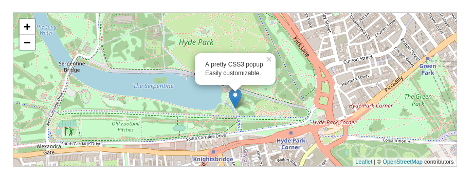

# Cartographie Web

* Afficher une carte sur une page web
  * Présentation de la librairie javascript Leaflet
  * Exo - Création d'une première carte
  * Exo - Exploration des outils carto - applat de couleurs

## Afficher une carte sur une page web

### Présentation de la librairie Leaflet

Leaflet est une librairie javascript. C'est à dire destiné à un contexte web. Malgré un nombre limité de fonctionnalité elle est facile d'accès. La librairie est robuste et tourne sans problème sur différents navigateurs et supports.

La librairie leaflet vous permet de creer une carte et aussi de :
* Lire les principaux flux de données carto
* Lire des données locales - format GeoJSON
* Interagir avec la carte : navigation à la souris, au clavier ou au "touché"
* Définir des effets visuels
* Ajouter des bulles d'info supportant l'HTML et le CSS

La [documentation développeur](https://leafletjs.com/reference-1.7.1.html) est disponible en ligne

### Exo 1 - Création d'une première carte

Version originale sur le site de [leaflet](https://leafletjs.com/examples/quick-start/)

### Exo 2 - Création d'une carte thématique

Version originale sur le site de [leaflet](https://leafletjs.com/examples/choropleth/)
