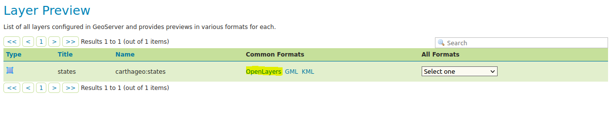

# Guide Geoserver

<!-- [TOC] -->
1. [Installation](#Installation)
2. [Créer un espace de travail](#Workspaces)
3. [Ajouter une couche depuis une Shapefile](#Shapefiles)
3. [Ajouter une couche depuis une base PostGIS](#PostGIS)

## Installation

1. Téléchargez geoserver sur [le site officiel](http://geoserver.org/release/stable/)

2. Sélectionnez **Packages - Platform Independent Binary**

3. Déposez le fichier sur votre disque à côté de votre site web, par exemple *D:/*

4. Dézippez le fichier *geoserver-2.20.2-bin.zip*, quelques fichiers importants pour nous :

- geoserver
  - bin
    - startup.bat
    - startup.sh
  - webapps
    - geoserver
      - WEB-INF
        - web.xml

5. Remplacez le fichier de configuration web.xml par [le notre](geoserver/web.xml). La nouvelle configuration autorise l'accès à geoserver pour vos scripts web - javascript.

6. Lancez geoserver ouvrir un terminal dans le repertoire geoserver et executer *startup.bat* pour windows, et *startup.sh* pour linux.

7. Accedez au service [geoserver local](http://localhost:8080)

8. Connectez-vous avec le compte **adminstrateur** par défault. 
  - Login: *admin*
  - Mot de passe : *admin*

Votre service geoserver est démarré avec succès.

## Workspaces

Ajouter un nouvel espace de travail dans geoserver

## Shapefiles

Cette étape permet d'ajouter un **entrepot** de type shapefile puis de publier une couche vectorielle.

1. Ajoutez un nouvel entrepot de type Shapefile

2. Configurez le nom, la description et le chemin vers votre donnée source puis valider

3. Publiez la couche

4. Les étapes importantes à cette étape; validez après ces 3 étapes.
- Contrôlez le système de référence
- Calculer l'emprise géographique des données *compute from data* puis *compute from native Bounds*
- Contrôlez le modèle de données *Feature Type Details*

5. Constulez la couche dans le menu *Layer preview*

6. Voici l'aperçu en mode *OpenLayers*, vous pouvez aussi selectionné le format WMS, WFS pour connaitre le chemin *public* de diffusion de votre donnée

## PostGIS

Cette étape permet d'ajouter un **entrepot** de type PostGIS puis de publier une couche vectorielle.

1. Ajoutez un nouvel entrepot de type PostGIS

